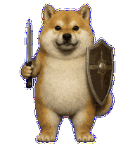

# 刀盾柴犬

由 Zhengjiazhi 创作的原创 3D 柴犬战士。它有圆润结实的体型、赤棕色毛发与奶油色胸腹，一只前爪握短刀，另一只前爪持盾。

## 动作

- 平稳呼吸、眨眼的安静待机。
- 清晰交替的左右移动步态。
- 挥手、跳跃与低头受挫动画。
- 区分等待、处理中与审查状态。
- 包含 16 个连续观察方向。

## 兼容性

- Codex pet sprite version：2
- 图集：透明 WebP，1536 × 2288
- 布局：8 列 × 11 行，单格 192 × 208

## 许可证与声明

宠物美术素材采用 [CC BY 4.0](LICENSE-ASSETS.md)，作者为 Zhengjiazhi。刀盾柴犬是原创角色，不包含可读品牌标识，与 OpenAI、Codex 或任何第三方品牌均无关联，亦未获得其赞助或背书。
